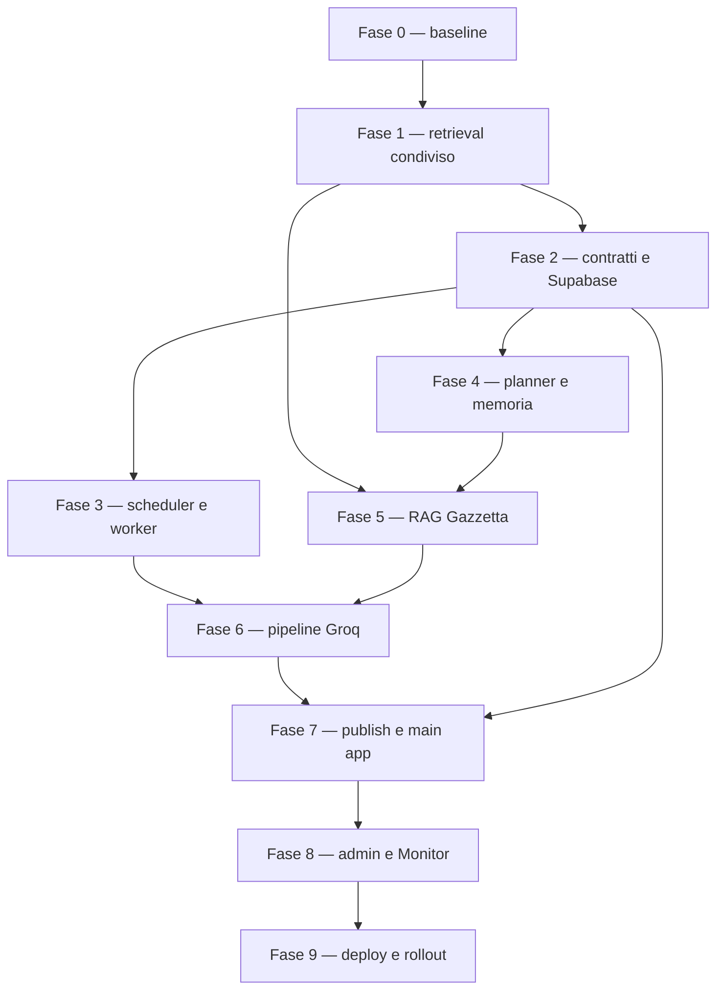

# Piano di sviluppo end-to-end

> **Stato:** implementazione locale completata; rollout live non attivato  
> **Data:** 2026-08-01  
> **Fonte architetturale:** `docs/software-design-specification.md`  
> **Ambito:** `neveran-gazzetta-engine`, Knowledge Engine, Lamp Assistant, main app e Monitor

## 1. Come usare questo piano

La Software Design Specification resta la fonte di verità per architettura e prodotto. Questo
documento trasforma quella specifica in una sequenza di lavoro verificabile.

Regole di esecuzione:

- non iniziare una fase se il gate della fase precedente non è soddisfatto;
- ogni modifica cross-repository deve essere integrabile e reversibile autonomamente;
- aggiornare stato e note di questo documento insieme al codice;
- non usare dipendenze live nei test bloccanti;
- non attivare pubblicazione automatica prima del gate di produzione;
- una decisione che cambia gli invarianti richiede ADR e aggiornamento della specifica;
- gli identificatori `GAZ-*`, `RAG-*`, `APP-*` e `MON-*` sono unità di lavoro, non issue GitHub
  già esistenti.

Legenda:

- `[x]` completato e verificato;
- `[ ]` da eseguire;
- **Gate**: condizione obbligatoria per avanzare;
- **Live opt-in**: prova esplicita con provider reali, mai parte della suite predefinita.

## 2. Stato di esecuzione al 1 agosto 2026

### Completato

- [x] repository locale `neveran-gazzetta-engine` inizializzato su branch `main`;
- [x] remote GitHub configurato;
- [x] specifica architetturale canonica;
- [x] configurazione non sensibile iniziale;
- [x] policy editoriale iniziale;
- [x] bootstrap Python, lint e test di configurazione;
- [x] documentazione iniziale di operazioni, prompt e runbook;
- [x] audit preliminare di Lamp, Knowledge Engine, Gazzetta UI, Dialogue Forge e Monitor.
- [x] F0–F8 implementate e verificate con suite offline;
- [x] wheel Gazzetta e Knowledge Engine costruite localmente;
- [x] entrypoint, preflight, canary e unit systemd pronti;
- [x] 90 test Gazzetta, 137 test Knowledge Engine e 184 test Main App verdi;
- [x] build PWA Main App e console Monitor verdi.

### Operazioni esterne ancora da eseguire

- [ ] commit e push, esclusi esplicitamente da questa sessione;
- [ ] applicazione revisionata delle migration sui progetti Supabase corretti;
- [ ] provisioning account worker, token Monitor e chiave Qdrant read-only;
- [ ] preflight e canary con i limiti reali dell'organizzazione Groq;
- [ ] prima pubblicazione controllata con approvazione esplicita;
- [ ] soak reale di almeno due settimane.

Le checklist dettagliate sotto conservano i singoli criteri di verifica. Le voci live restano
aperte anche quando il relativo software o test fake è già presente.

### Stato dei gate

| Gate | Stato | Evidenza |
| --- | --- | --- |
| F0 `bootstrap-ready` | pronto localmente | config strict, CI, test/lint/mypy |
| F1 `shared-retrieval-ready` | pronto localmente | package 0.4.0, Lamp contract, adapter read-only |
| F2 `storage-contract-ready` | pronto per migration test | migration, RLS e RPC staticamente testate |
| F3 `worker-recoverable` | pronto localmente | DST, latest-only, lease e failure tests |
| F4 `editorial-plan-safe` | superato | 1.000 seed e guardrail storyline/entity |
| F5 `grounded-context-ready` | superato offline | query/palette/injection/release tests |
| F6 `edition-validatable` | superato offline | 3+1 call, budget, eval e 429 tests |
| F7 `product-integrated` | superato offline | fixture cross-language, 184 test e build PWA |
| F8 `operable` | superato offline | admin, audit, buffer e dashboard Monitor |
| F9 `production-ready` | aperto | richiede deployment, canary, prima edizione e soak |

## 3. Percorso critico



La Fase 1 è il rischio tecnico principale e il primo vero sviluppo. Evita di copiare nel nuovo
engine il retriever Lamp e corregge due difetti già individuati: manifest incrementale non
allineato alla collection completa e indisponibilità Qdrant confusa con assenza di risultati.

## 4. Workstream e ownership

| Workstream | Repository autorevole | Risultato |
| --- | --- | --- |
| Retrieval e release lore | `neveran-knowledge-engine` | package condiviso read-only |
| Regressione consumer factual | `neveran-lamp-assistant-rag` | Lamp migra senza cambiare comportamento |
| Motore editoriale | `neveran-gazzetta-engine` | worker, planner, RAG, Groq e API operativa |
| Schema runtime e prodotto | `neveran-main-app` | migration, RLS, pagina player e console admin |
| Osservabilità aggregata | `neveran-monitor` | service slug, eventi e dashboard |

Ordine di integrazione cross-repository consigliato:

1. contratti e implementazione nel Knowledge Engine;
2. migrazione e regressione Lamp;
3. pin della release condivisa nel Gazzetta Engine;
4. migration e contratti frontend nella main app;
5. registrazione e dashboard nel Monitor.

Ogni repository mantiene i propri test e le proprie istruzioni. Evitare PR che richiedano il
merge simultaneo di più repository per lasciare il sistema funzionante.

---

## 5. Fase 0 — Baseline riproducibile

**Obiettivo:** rendere il nuovo repository una base installabile, verificata e pronta al lavoro
cross-repository, senza contattare servizi esterni.

### GAZ-000 — Pubblicare il bootstrap

- [x] revisionare lo scope dei file non tracciati;
- [x] eseguire test, Ruff e parsing YAML;
- [ ] creare il primo commit intenzionale;
- [ ] pushare `main` sul repository remoto vuoto;
- [x] verificare che `.env`, output live e raw response restino ignorati.

### GAZ-001 — Struttura applicativa

- [x] creare package `domain`, `application`, `adapters`, `scheduling`, `generation`, `storage`,
  `telemetry`, `worker` e `api`;
- [x] mantenere domain e application indipendenti da FastAPI, Groq, Qdrant e Supabase concreti;
- [x] introdurre porte tramite `Protocol` o ABC esplicite;
- [x] aggiungere exception hierarchy stabile e codici errore serializzabili;
- [x] separare test `unit`, `contract`, `integration`, `eval` e fixture.

### GAZ-002 — Configurazione tipizzata

- [x] caricare YAML più environment tramite Pydantic Settings;
- [x] usare `extra="forbid"` per configurazione e contratti autorevoli;
- [x] validare pesi editoriali, conteggi slot, budget e riferimenti env;
- [x] calcolare hash/versione della policy usata in ogni run;
- [x] fallire all'avvio per configurazione incoerente o segreti mancanti in modalità live;
- [x] non richiedere segreti nei test offline.

### GAZ-003 — Qualità e CI

- [x] aggiungere workflow per `pytest`, `ruff check .` e `mypy src`;
- [x] aggiungere scansione accidentale di segreti;
- [x] vietare accesso rete nella suite standard;
- [x] pubblicare coverage come informazione, senza abbassare i guardrail per superare la CI;
- [x] documentare convenzione ADR e aggiornamento del piano.

**Gate F0 — `bootstrap-ready`**

- repository clonabile e installabile da zero;
- CI verde senza credenziali;
- configurazione invalida rifiutata con errore leggibile;
- nessuna chiamata live possibile per effetto collaterale di import o test.

---

## 6. Fase 1 — Stabilizzazione ed estrazione del retrieval condiviso

**Obiettivo:** un solo core di embedding, accesso Qdrant, scoring e release, consumato da Lamp e
Gazzetta con profili distinti.

### RAG-100 — Caratterizzare il comportamento Lamp

Repository: `neveran-lamp-assistant-rag`.

- [x] golden test per filtro dei documenti pubblici approvati;
- [x] golden test per query embedding `retrieval.query` e documenti `retrieval.passage`;
- [x] test per dimensione embedding, cosine distance e metadati chunk;
- [x] test per deduplica, bilanciamento documenti, reranking e soglie;
- [x] test per release attiva e mismatch;
- [x] test che distinguano davvero zero evidenze da provider indisponibile;
- [x] snapshot di un set di query rappresentative prima del refactor.

### RAG-101 — Correggere i difetti di base

Repository: `neveran-lamp-assistant-rag`, con contratto concordato nel Knowledge Engine.

- [x] correggere il manifest incrementale affinché `chunk_count` rappresenti la collection
  completa e non soltanto i chunk modificati;
- [x] impedire ai catch generici Qdrant di restituire silenziosamente una lista vuota;
- [x] introdurre errori distinti `NoEvidence`, `ProviderUnavailable` e `ReleaseMismatch`;
- [x] aggiungere test di regressione per rebuild completo, aggiornamento incrementale e outage;
- [x] non modificare la collection live durante lo sviluppo.

### RAG-110 — Creare `neveran_knowledge.retrieval_core`

Repository: `neveran-knowledge-engine`.

- [x] definire `RetrievedChunk`, `RetrievalTrace`, `CorpusRelease` e profili tipizzati;
- [x] definire porte per embedder, candidate store, reranker e release provider;
- [x] implementare adapter Jina query e Qdrant esclusivamente read-only;
- [x] centralizzare dimensione, task, distance e validazione release manifest;
- [x] esporre `embed_query`, `search_candidates`, `hybrid_retrieve` e
  `get_active_release` senza persona o prompt applicativi;
- [x] verificare che l'API pubblica non esponga upsert, delete o create collection;
- [x] aggiungere telemetria priva di testo lore e segreti;
- [x] creare ADR per distribuzione del package; default consigliato: wheel installata da tag Git
  pin-nato finché non serve un registry dedicato.

### RAG-120 — Migrare Lamp al package condiviso

Repository: `neveran-lamp-assistant-rag`.

- [x] sostituire progressivamente implementazioni duplicate con adapter del package;
- [x] mantenere invariati `/ask`, persona, TTS e policy Lamp;
- [x] confrontare i risultati con gli snapshot di RAG-100;
- [x] documentare ogni differenza intenzionale;
- [ ] rimuovere il vecchio core soltanto dopo cutover e rollback verificato.

### RAG-130 — Collegare il Gazzetta Engine

Repository: `neveran-gazzetta-engine`.

- [x] pin-nare una release del package condiviso;
- [x] definire il profilo `gazzetta_generation` senza ActorProfile di campagna;
- [x] costruire un adapter applicativo che non importi `/ask` o Jhonny;
- [x] testare error mapping e release alignment con fake;
- [x] aggiungere un test statico/contrattuale che impedisca metodi Qdrant mutanti.

**Gate F1 — `shared-retrieval-ready`**

- Lamp supera la batteria pre-refactor senza regressioni non approvate;
- outage e no-evidence producono esiti differenti;
- manifest incrementale e collection risultano allineati;
- Gazzetta consuma il package pin-nato e non copia il retriever;
- nessuna credenziale Gazzetta consente scritture Qdrant.

---

## 7. Fase 2 — Contratti di dominio e control plane Supabase

**Obiettivo:** fissare schema e sicurezza prima di implementare scheduler, generazione e UI.

### GAZ-200 — Modelli di dominio

Repository: `neveran-gazzetta-engine`.

- [x] implementare enum di slot, stato job, stato run, verità, reporting e storyline;
- [x] implementare `GazzettaEvent`, `GazzettaEditionDraft` e `GazzettaEditionSnapshot`;
- [x] implementare modelli compatti per storyline, entità, source ref e validation report;
- [x] applicare `extra="forbid"`, ID e timestamp espliciti;
- [x] separare snapshot player da metadati operativi;
- [x] esportare JSON Schema versionati;
- [x] creare fixture valide e invalide condivisibili con TypeScript.

### APP-210 — Migration dati

Repository: `neveran-main-app`, cartella `supabase/migrations`.

- [x] creare `gazzetta_engine_state`;
- [x] creare `gazzetta_workers`;
- [x] creare `gazzetta_generation_jobs` con `schedule_slot` unique;
- [x] creare `gazzetta_generation_runs`;
- [x] creare `gazzetta_storylines` e `gazzetta_entities`;
- [x] creare `gazzetta_events` e `gazzetta_editions`;
- [x] aggiungere indici, foreign key, check ed esclusività di `is_current`;
- [x] aggiungere audit append-only per operazioni sensibili;
- [x] configurare retention raw e compattazione senza cancellare edizioni.

### APP-211 — Identità, RPC e RLS

- [ ] introdurre ruolo/account dedicato `gazzetta_worker`, senza service role key;
- [x] implementare heartbeat, lease, renew, submit run, publish e fail tramite RPC;
- [x] implementare le quattro RPC admin previste;
- [x] non creare alcuna RPC `generate-now`;
- [x] limitare i player alla sola edizione `published` e `is_current`;
- [x] negare al player job, run, eventi interni, storyline ed entità;
- [ ] testare ruoli player, admin, worker e anon;
- [x] sanitizzare errori e impedire escalation di ruolo.

### GAZ-212 — Contract test database

- [x] verificare payload RPC con modelli Pydantic;
- [x] verificare compatibilità tra JSON Schema e tipi TypeScript;
- [ ] testare publish atomico in transazione;
- [ ] testare rollback su ogni punto critico della RPC;
- [ ] testare withdraw e restore senza cancellazione;
- [ ] mantenere questi test su Supabase locale o progetto test, mai produzione.

**Gate F2 — `control-plane-ready`**

- migration ripetibili su database pulito;
- tutti i test RLS verdi;
- publish atomico dimostrato con payload fixture;
- worker incapace di leggere o scrivere fuori dalle RPC autorizzate;
- contratti Python, JSON e TypeScript allineati.

---

## 8. Fase 3 — Scheduler, job lifecycle e worker senza LLM

**Obiettivo:** provare l'autonomia operativa usando adapter fake e payload fixture.

### GAZ-300 — Tempo editoriale

- [x] introdurre una porta `Clock` testabile;
- [x] calcolare gli slot ogni due giorni alle 06:00 `Europe/Rome`;
- [x] coprire passaggi ora legale/solare e timestamp UTC;
- [x] implementare `latest_due_only`;
- [x] marcare gli slot vecchi `missed` senza generare backlog;
- [x] incrementare `issue_number` soltanto al publish riuscito;
- [x] usare l'ora reale in `publicationDate`.

### GAZ-301 — Coda, lease e recovery

- [x] implementare adapter RPC Supabase;
- [x] acquisire lease idempotente per `schedule_slot`;
- [x] rinnovare lease e heartbeat;
- [x] recuperare job dopo crash o lease scaduto;
- [x] classificare retry e backoff per errore;
- [x] evitare che quota o attesa provider consumino tentativi di contenuto;
- [x] testare due worker concorrenti e crash in ogni fase.

### GAZ-302 — Orchestratore worker

- [x] tick immediato all'avvio;
- [x] state machine esplicita delle fasi;
- [x] porte per retrieval, planner, writer, verifier e publisher;
- [x] adapter fake deterministici per completare un'edizione fixture;
- [x] cancellazione sicura su pausa;
- [x] shutdown coordinato senza perdere lease o corrompere run;
- [x] nessun loop di retry non limitato.

### GAZ-303 — API operativa minimale

- [x] `GET /health` senza dipendenze o dettagli sensibili;
- [x] endpoint autenticati `ready`, `status`, `runs/{id}` e release retrieval;
- [x] `POST /v1/internal/tick` ristretto a localhost o token worker;
- [x] nessun endpoint chat, prompt arbitrario o `generate-now`;
- [x] autenticazione fail-closed e test di sicurezza.

**Gate F3 — `autonomous-worker-offline`**

- un clock simulato produce gli slot corretti per almeno un anno, incluso DST;
- due worker non duplicano job o numeri;
- recovery da crash non pubblica metà snapshot;
- l'intero flusso fixture gira senza rete e lascia audit diagnostico.

---

## 9. Fase 4 — Planner deterministico, storyline ed entità

**Obiettivo:** decidere struttura, varietà e continuità prima di chiedere prosa a Groq.

### GAZ-400 — Slot planner e seed

- [x] produrre esattamente 3 breaking, 1 lead, 2 major, 2 minor e 1 brief;
- [x] derivare la seed da slot, release, policy e nonce registrato;
- [x] rendere riproducibili tutte le scelte casuali;
- [x] applicare pesi per tipo di slot senza quote rigide;
- [x] massimo una fake deliberata, mai obbligatoria;
- [x] vietare fake in lead, breaking e major;
- [x] evitare duplicati tematici all'interno dello stesso numero;
- [x] produrre un piano serializzabile e ispezionabile.

### GAZ-401 — Storyline ledger

- [x] implementare stati `active`, `cooling`, `closed`, `epilogue`;
- [x] massimo quattro apparizioni inclusa l'iniziale;
- [x] massimo un epilogo terminale;
- [x] massimo una presenza per edizione;
- [x] supportare edizioni saltate con `next_eligible_at`;
- [x] compattare recap a 180 parole e contesto a 500 token;
- [x] impedire che un filone chiuso rientri nel prompt ordinario;
- [x] testare tutte le transizioni e i limiti.

### GAZ-402 — Entità e firme ricorrenti

- [x] registro leggero di PNG, testimoni, luoghi effimeri e giornalisti;
- [x] nucleo riconoscibile di firme con rotazione;
- [x] cooldown e penalità per apparizioni ravvicinate;
- [x] possibilità di riuso futuro in un nuovo filone;
- [x] distinzione rigorosa dai registry canonici;
- [x] normalizzazione per evitare duplicati quasi identici.

### GAZ-403 — Guardrail deterministici editoriali

- [x] validare tassonomia interna e compatibilità slot;
- [x] vietare come reali nuove divinità, cosmologia e grandi poteri;
- [x] consentire invenzioni umane e locali superficiali;
- [x] applicare la regola “Loop” come materiale soltanto;
- [x] validare lingua, budget e unicità degli ID;
- [x] test statistici sui pesi con seed note;
- [x] property test sugli invarianti hard.

**Gate F4 — `editorial-plan-ready`**

- migliaia di piani seeded non violano slot, fake o storyline;
- stessa seed e stesso input producono lo stesso piano;
- nessun testo completo o history lunga è necessario al planner;
- i guardrail hard non dipendono da un LLM.

---

## 10. Fase 5 — RAG editoriale Gazzetta

**Obiettivo:** trasformare la lore pubblica in una palette compatta che vincola l'invenzione senza
copiarla o trasformarla in canon.

### GAZ-500 — Generazione multi-query

- [x] generare fino a cinque query separate per luogo, quotidianità, istituzione/mestiere,
  commercio/materiale e filone;
- [x] evitare query semanticamente sovraccariche;
- [x] deduplicare per `chunk_id`;
- [x] massimo tre chunk per documento e dieci complessivi;
- [x] mantenere trace query → chunk → slot.

### GAZ-501 — `GazzettaLorePalette`

- [x] estrarre fatti, vincoli, luoghi, istituzioni e terminologia;
- [x] distinguere elementi utilizzabili, conflitti, lacune e fonti diegetiche possibili;
- [x] conservare `corpus_release_id` e source refs;
- [x] limitare il contesto lore a 3.000 token;
- [x] trattare i chunk come dati e non come istruzioni;
- [x] impedire che citation ID tecnici arrivino alla pagina player.

### GAZ-502 — Sufficienza e fail-closed

- [x] soglie configurabili per slot e per edizione;
- [x] cambiare argomento quando manca evidenza per uno slot;
- [x] fallire l'intera edizione quando il grounding globale è insufficiente;
- [x] abortire su Qdrant/Jina outage o release mismatch;
- [x] rilevare cambio release durante il run;
- [x] non riutilizzare eventi pianificati su una release diversa.

### GAZ-503 — Test retrieval

- [x] integration test con Qdrant fake/in-memory e chunk noti;
- [x] Jina stub con dimensione verificata;
- [x] dataset per contesto sufficiente, scarso, conflittuale e malevolo;
- [ ] live opt-in read-only su una release reale;
- [x] nessun log con testo lore completo.

**Gate F5 — `grounding-ready`**

- ogni evento pianificabile conserva source refs verificabili internamente;
- outage, mismatch e insufficienza impediscono la generazione;
- la palette rispetta i budget;
- le prove live usano esclusivamente credenziali Qdrant read-only.

---

## 11. Fase 6 — Pipeline Groq, validazione ed evaluation

**Obiettivo:** produrre una prima pagina completa e validata entro i limiti del free tier.

### GAZ-600 — Prompt e schema Event Planner

- [x] creare prompt versionato e strict JSON Schema;
- [x] inviare slot plan, Lore Palette, storyline selezionate, policy e seed;
- [x] produrre eventi e fonti, non articoli completi;
- [x] conservare classificazioni interne di verità e source refs;
- [x] vietare proprietà extra e claim non grounded;
- [x] testare prompt injection e output malformato.

### GAZ-601 — Newspaper Writer

- [x] creare prompt versionato per italiano editoriale;
- [x] trasformare soltanto eventi già validati;
- [x] rispettare i budget di ogni slot;
- [x] creare fonti, citazioni e dettagli umani entro i limiti inventivi;
- [x] non cambiare truth metadata o aggiungere grandi eventi;
- [x] rigenerare ogni insert della pagina a ogni edizione.

### GAZ-602 — Validazione deterministica

- [x] numero e tipo esatto di slot;
- [x] budget caratteri, parole e paragrafi;
- [x] lingua italiana e normalizzazione Unicode;
- [x] niente placeholder, Lorem Ipsum, metadati tecnici o HTML modello;
- [x] regola Loop;
- [x] fake e storyline nei soli slot ammessi;
- [x] source coverage e compatibilità con eventi validati.

### GAZ-603 — Verifier e singola riparazione

- [x] prompt verifier strict con `pass`, `repairable`, `reject`;
- [x] codici difetto stabili;
- [x] verifier incapace di riscrivere direttamente l'edizione;
- [x] una sola chiamata di repair;
- [x] nuova validazione deterministica e nuovo verifier dopo repair;
- [x] secondo fallimento terminale senza pubblicazione.

### GAZ-604 — Adapter Groq e budget

- [x] un solo adapter HTTP per planner, writer, verifier e repair;
- [x] modelli configurabili, nessun fallback provider;
- [x] leggere e registrare gli header rate-limit;
- [x] rispettare `retry-after` e reset comunicati dal provider;
- [x] massimo tre chiamate normali e una repair;
- [x] massimo 35.000 token per edizione;
- [x] rinviare il job se il budget residuo noto non è sufficiente;
- [x] sanitizzare prompt e raw response nella telemetria.

### GAZ-605 — Evaluation narrativa

- [x] dataset versionato per serio, assurdo credibile, dissacrante e fake secondaria;
- [x] scenari storyline 2/3/4, epilogo ed entità ricorrenti;
- [x] scenari di lore scarsa, conflitto cosmologico e uso errato di Loop;
- [x] valutare world fit, italiano, varietà, ripetizione e attendibilità percepita;
- [x] misurare token, repair rate e reject rate;
- [ ] verificare i limiti reali dell'organizzazione Groq prima del deploy;
- [ ] approvare i modelli con live eval opt-in, mai con pubblicazione.

**Gate F6 — `edition-validatable`**

- zero violazioni hard nel dataset di sicurezza;
- tutte le edizioni accettate rispettano schema e budget;
- costo massimo imposto dal codice e comportamento 429 verificato;
- qualità italiana e varietà approvate su un campione revisionato;
- nessuna chiamata Groq può pubblicare direttamente.

---

## 12. Fase 7 — Pubblicazione atomica e integrazione main app

**Obiettivo:** portare uno snapshot validato al giocatore senza esporre il motore o i metadati.

### GAZ-700 — Publisher

- [x] inviare run validato, content hash, eventi, storyline ed entità alla RPC atomica;
- [x] verificare lease, release e policy prima del publish;
- [x] rendere idempotente il retry della stessa pubblicazione;
- [x] aggiornare edizione corrente, job, ledger e `next_due_at` nella stessa transazione;
- [x] non modificare l'edizione corrente su qualsiasi errore;
- [x] testare crash prima, durante e dopo la risposta RPC.

### APP-710 — Contratto frontend

- [x] estendere `GazzettaEdition` con `schemaVersion` e campi compatibili;
- [x] creare parser/validator al confine Supabase;
- [x] mappare il visual tone `loop` a `loop_material` con compatibilità controllata;
- [x] non includere source refs, truth metadata o dati operativi nel tipo player;
- [x] usare fixture generate dallo stesso JSON Schema.

### APP-711 — Lettura ed esperienza player

- [x] creare `gazzettaApi.ts` per leggere soltanto l'edizione corrente;
- [x] gestire loading, errore, assenza prima edizione e snapshot valido;
- [x] usare last-known snapshot locale soltanto come fallback progressivo;
- [x] rimuovere il mock demo dal percorso produzione mantenendolo nei test/story fixture;
- [x] aggiornare anche la preview home;
- [x] mantenere artwork e relativi metadati statici nella v1;
- [x] accettare l'immagine lead opzionale introdotta da ADR-0002 senza perdere il fallback;
- [x] rendere accessibili tutte e tre le breaking news su mobile;
- [x] rispettare reduced motion e layout con testi ai limiti massimi.

### APP-712 — Test prodotto

- [x] contract test Python ↔ JSON Schema ↔ TypeScript;
- [x] test componenti per tutti gli stati di lettura;
- [ ] test responsive e Android WebView;
- [x] test di snapshot lunghi e caratteri Unicode;
- [x] verifica che nessun contenuto modello sia renderizzato come HTML;
- [x] verifica che la stessa edizione sia globale per tutti i player.

**Gate F7 — `product-integrated`**

- un snapshot fixture pubblicato via RPC appare completo nella pagina;
- tutti e tre i breaking sono accessibili su mobile;
- il player non chiama mai Engine, Groq, Jina o Qdrant;
- fallimenti backend lasciano visibile l'ultima edizione valida;
- nessun metadato interno è leggibile dal ruolo player.

---

## 13. Fase 8 — Console admin e Neveran Monitor

**Obiettivo:** rendere il sistema osservabile e controllabile senza introdurre generazione manuale.

### APP-800 — Console amministrativa

- [x] mostrare heartbeat, versione worker, pausa e stato engine;
- [x] mostrare edizione corrente, ultima pubblicazione e prossima scadenza;
- [x] mostrare job, fase, tentativi ed errore sanitizzato;
- [x] mostrare release Qdrant, modelli Groq, token e rate-limit osservati;
- [x] mostrare storyline, edizioni ritirate e ultimi run;
- [x] implementare pausa e riprendi;
- [x] implementare ritira corrente e ripristina precedente;
- [x] mostrare `Genera ora` disabled con testo previsto;
- [x] verificare che non esista alcun endpoint o RPC corrispondente;
- [ ] gate admin e test di ruolo.

### MON-810 — Telemetria

- [x] registrare service slug `gazzetta-engine`;
- [x] eventi scheduler, lease, run, provider, validation, publish e heartbeat;
- [x] metriche durata, token, tentativi, release, policy e prompt version;
- [x] nessun prompt, lore completa, raw response o segreto;
- [x] buffer locale limitato quando Monitor è offline;
- [x] Monitor fail-open senza perdere lo stato autorevole Supabase.

### MON-811 — Dashboard e allarmi

- [x] worker offline/heartbeat scaduto;
- [x] edizione in ritardo;
- [x] quota Groq e repair rate anomalo;
- [x] Qdrant/Jina outage e release mismatch;
- [x] job dead letter;
- [x] publish/withdraw/restore auditabili;
- [x] link operativo al runbook.

**Gate F8 — `operable`**

- ogni failure della matrice produce stato e diagnostica utilizzabili;
- controlli admin sono autorizzati, atomici e auditati;
- Monitor offline non blocca un'edizione, ma non accumula dati senza limite;
- `Genera ora` è soltanto presentazione mockata.

---

## 14. Fase 9 — Deploy neveranforge e rollout controllato

**Obiettivo:** attivare l'autonomia solo dopo prove di sicurezza, recovery e qualità.

### GAZ-900 — Packaging e systemd

- [x] definire entry point versionati per API e worker;
- [x] creare service e timer systemd reali;
- [x] predisporre un utente Linux dedicato non root nelle unit;
- [x] documentare venv e checkout dedicati, deploy da commit/tag pin-nato;
- [x] documentare `.env` con permessi minimi;
- [x] configurare restart con backoff, startup tick e heartbeat;
- [x] implementare health/readiness locali;
- [x] documentare rollback codice senza cancellare dati.

### GAZ-901 — Preparazione ambiente

- [ ] applicare migration revisionate separatamente;
- [ ] creare account worker e chiave Qdrant read-only;
- [ ] configurare segreti Groq, Jina, Supabase, Monitor e API;
- [ ] verificare modelli Groq disponibili e limiti reali;
- [ ] verificare release Qdrant e dimensione embedding;
- [ ] provare pausa, recovery e revoca credenziali;
- [ ] non usare service role key sul mini PC.

### GAZ-902 — Canary senza pubblicazione

- [ ] eseguire più cicli completi con publisher sostituito da sink di canary;
- [ ] simulare recovery con uno e più slot scaduti;
- [ ] simulare 429, provider outage, release mismatch e output invalido;
- [ ] revisionare manualmente qualità, fonti e varietà;
- [ ] verificare storage, retention e assenza di dati sensibili nei log;
- [ ] misurare consumo medio e worst case.

### GAZ-903 — Prima pubblicazione controllata

- [ ] preparare un'edizione completa validata ma non corrente;
- [ ] approvazione esplicita al passaggio in produzione;
- [ ] attivare una sola pubblicazione tramite il normale scheduler;
- [ ] verificare player, admin, Monitor e audit;
- [ ] provare ritiro/ripristino su fixture o staging prima del bisogno reale;
- [ ] mantenere pronto il rollback software.

### GAZ-904 — Soak e piena autonomia

- [ ] osservare almeno due settimane come richiesto dalla specifica;
- [ ] controllare almeno più scadenze reali delle 06:00 Europe/Rome;
- [ ] misurare ritardi, repair, reject, token e ripetitività;
- [ ] verificare filoni tra numeri successivi e non successivi;
- [ ] correggere soltanto tramite config versionata, prompt version o ADR;
- [ ] dichiarare produzione stabile dopo revisione dei risultati.

**Gate F9 — `production-ready`**

- tutti i 22 acceptance criteria della specifica sono dimostrati;
- recovery e rollback sono stati provati;
- zero scritture Qdrant e zero dipendenze da `/ask`;
- il budget Groq reale è sostenibile;
- due settimane di osservazione non mostrano violazioni hard o perdita dell'edizione corrente.

---

## 15. Piano di test trasversale

| Livello | Quando | Rete | Scopo |
| --- | --- | --- | --- |
| Unit | ogni modifica | no | logica pura, policy, clock, validator |
| Contract | ogni modifica ai confini | no | Pydantic, JSON Schema, TS, RPC, payload Qdrant |
| Integration fake/local | prima del merge | no Internet | adapter, Supabase locale, Qdrant fake, Groq stub |
| Security/RLS | ogni migration o endpoint | locale/test | ruoli, auth fail-closed, dati non esposti |
| Eval narrativa offline | ogni prompt/policy | no | fixture e risposte registrate sanitizzate |
| Live opt-in | prima di deploy/modello | sì, esplicita | provider, qualità, quote e release reali |
| UI responsive | Fase 7 e regressioni | no | browser, mobile, WebView, reduced motion |
| Soak | Fase 9 | ambiente target | scheduling, autonomia, recovery e costi |

Controlli minimi prima di chiudere qualunque fase Python:

```powershell
pytest
ruff check .
mypy src
```

Per migration e frontend aggiungere i comandi previsti dalla main app e i test RLS. Le live suite
devono essere nominate e marcate chiaramente, non eseguite da CI standard.

## 16. Definition of Done per unità di lavoro

Un task è completo soltanto quando:

- il comportamento richiesto è implementato senza violare ownership o invarianti;
- esistono test positivi, negativi e di failure proporzionati al rischio;
- errori tecnici non vengono trasformati in output vuoti o successo apparente;
- log e telemetria non espongono segreti, prompt o lore completa;
- configurazione e contratti sono documentati;
- migration includono indici, RLS, rollback logico e test dei ruoli;
- i contratti cross-repository hanno versione e consumer testati;
- l'ultima edizione valida sopravvive a ogni nuovo failure path;
- il piano viene aggiornato se lo stato reale cambia;
- non resta codice morto o duplicato senza una ragione documentata.

## 17. Strategia di merge e release

- una PR per unità coerente e, quando possibile, per un solo repository;
- prima i test di caratterizzazione, poi il refactor;
- prima i contratti, poi producer e consumer;
- package condiviso rilasciato con tag/versione immutabile;
- Gazzetta e Lamp pin-nano esplicitamente la versione;
- migration applicate separatamente dal deploy del worker;
- schema additivo prima del cutover, rimozioni soltanto dopo verifica;
- prompt e policy registrano versione/hash in ogni run;
- nessun deploy da working tree non pulito o branch non pin-nato;
- nessun merge attiva automaticamente la pubblicazione in produzione.

## 18. Rischi e checkpoint

| Rischio | Checkpoint | Blocco richiesto |
| --- | --- | --- |
| drift Lamp/Gazzetta | fine F1 | package unico e regressione Lamp verde |
| schema non sicuro | fine F2 | RLS e RPC testate per tutti i ruoli |
| doppia pubblicazione | fine F3/F7 | concorrenza, idempotenza e transazione |
| allucinazione profonda | fine F5/F6 | grounding, validator e verifier |
| qualità italiana debole | fine F6 | live eval revisionata |
| free tier insufficiente | fine F6/F9 | budget hard e limiti account misurati |
| ripetitività | fine F4/F6/F9 | seed, cooldown e metriche longitudinali |
| layout rotto | fine F7 | budget hard e test responsive |
| worker offline | fine F3/F9 | catch-up latest-only e recovery reale |
| perdita edizione corrente | ogni fase dal publish | rollback e last-valid invariant |

## 19. Prossimo blocco operativo

Il software non va esteso prima del rollout. L'ordine successivo è:

1. revisionare e committare separatamente i cambi cross-repository;
2. applicare le migration in ambiente test;
3. provisionare identità e segreti con privilegi minimi;
4. eseguire `gazzetta-preflight --confirm-live-read-only`;
5. eseguire più `gazzetta-canary --confirm-live-no-publish` e compilare le review eval;
6. approvare una prima pubblicazione attraverso lo scheduler normale;
7. osservare almeno due settimane prima di dichiarare F9 superata.

## 20. Funzionalità esplicitamente successive alla v1

Non entrano nel percorso di rilascio iniziale:

- archivio player delle edizioni passate;
- generazione di immagini, ora promossa nel piano post-v1
  `docs/generated-artwork-implementation-plan.md`;
- promozione umana di eventi nel canon;
- pulsante funzionante `Genera ora`;
- provider LLM alternativi a Groq;
- personalizzazione per campagna o giocatore;
- endpoint chat o scrittura giornalistica arbitraria.

Possono essere pianificate solo dopo il soak della v1 e con una nuova specifica o ADR.
