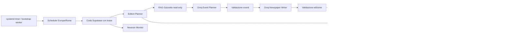

# Neveran Gazzetta Engine — Software Design Specification

> **Stato:** specifica tecnica canonica, versione `0.1`  
> **Data:** 2026-08-01  
> **Owner:** repository `neveran-gazzetta-engine`  
> **Repository remoto:** `https://github.com/WineOfHub/neveran-gazzetta-engine.git`  
> **Lingua del prodotto:** italiano  
> **Cadenza:** una nuova edizione ogni due giorni alle 06:00, fuso `Europe/Rome`

## 0. Autorità del documento

Questa è la fonte di verità architetturale del Gazzetta Engine. Le decisioni di prodotto,
sicurezza, persistenza, scheduling e generazione descritte qui prevalgono su note o prototipi
precedenti della main app.

La documentazione della main app può descrivere l'integrazione UI, ma deve collegare questa
specifica e non duplicarne i contratti. Le modifiche sostanziali richiedono una ADR nello stesso
repository e l'aggiornamento della versione del documento.

---

## 1. Sintesi esecutiva

Neveran Gazzetta Engine è un software autonomo che genera e pubblica la prima pagina globale
della Gazzetta del CCIN. Il motore non usa `/ask` del Lamp Assistant e non adotta la persona o
il prompt factual di Jhonny.

Il sistema:

- legge in sola lettura la stessa lore pubblica indicizzata in Qdrant;
- usa lo stesso contratto di embedding e retrieval condiviso con il Lamp Assistant;
- costruisce un proprio contesto editoriale per la generazione;
- pianifica eventi effimeri e non canonici appartenenti al mondo di Neveran;
- trasforma gli eventi in una prima pagina strutturata;
- valida formato, lunghezza, attendibilità e compatibilità con la lore;
- pubblica autonomamente uno snapshot in Supabase;
- conserva una memoria compatta di filoni e personaggi ricorrenti;
- lascia online l'ultima edizione valida quando qualsiasi fase fallisce;
- espone diagnostica e controlli amministrativi, ma nessuna chat e nessun endpoint player LLM.

La Gazzetta è globalmente uguale per tutti gli utenti. Non dipende da campagna, tavolo,
personaggio, scoperte o stato runtime.

---

## 2. Decisioni di prodotto consolidate

### 2.1 Natura editoriale

- La Gazzetta è una pubblicazione diegetica globale del CCIN.
- È prevalentemente attendibile e usa fonti credibili.
- Neveran è realmente folle e assurda: una notizia strana non è automaticamente falsa.
- Notizie secondarie possono essere comiche, dissacranti, improbabili o deliberatamente false.
- Le fake news non ricevono etichette visibili.
- Il testo deve comunque offrire segnali narrativi coerenti con la natura della fonte.
- Lead story e breaking news non possono essere fake news deliberate.
- Gli eventi sono decorativi e non modificano gameplay, quest, personaggi, organizzazioni o lore.

### 2.2 Rapporto con il canon

- Tutto ciò che il motore genera è non canonico ed effimero.
- Nessun output viene scritto nel corpus Markdown o nella collection Qdrant canonica.
- Nessun evento diventa canon automaticamente.
- Un'eventuale promozione futura richiederà un flusso editoriale separato e umano.
- Il motore può inventare persone comuni, relazioni, mestieri, botteghe, strade, merci,
  problemi sociali e piccoli luoghi locali.
- Non può inventare come reali divinità, cosmologia, grandi poteri, nuove leggi metafisiche o
  eventi capaci di piegare il mondo.
- Una falsità profonda può comparire soltanto se classificata internamente come falsa e confinata
  a un articolo secondario.

### 2.3 Regola vincolante sul Loop

La parola “Loop” indica esclusivamente il materiale rarissimo e pregiato di Neveran.

Sono vietati usi con significato di:

- ciclo temporale;
- ripetizione;
- processo ricorsivo;
- anello narrativo;
- fenomeno generico.

In questi casi il testo deve usare termini come `ciclo`, `ripetizione`, `sequenza` o
`ricorrenza`.

Il visual tone TypeScript esistente `loop` deve essere rinominato in `loop_material`, con una
migrazione compatibile dei dati eventualmente già persistiti.

### 2.4 Periodicità

- Cadenza: ogni due giorni.
- Ora editoriale: 06:00.
- Fuso autorevole: `Europe/Rome`.
- `publicationDate` mostra l'orario reale di pubblicazione, anche in caso di ritardo.
- Se il worker torna online prima che sia dovuta l'edizione successiva, genera immediatamente.
- Se è già dovuto uno slot successivo, il vecchio slot viene marcato `missed` e non viene
  recuperato.
- Non si generano mai più edizioni arretrate in sequenza.
- Il numero dell'edizione aumenta soltanto alla pubblicazione riuscita.
- Un'edizione ritirata conserva il proprio numero.

### 2.5 Continuità

- Un filone può apparire una sola volta nella stessa edizione.
- Può avere al massimo quattro apparizioni totali, inclusa la notizia iniziale.
- Dopo la chiusura è consentito un unico aggiornamento-extra, classificato come epilogo.
- Un filone chiuso può essere ripreso soltanto per quell'epilogo.
- Persone comuni inventate possono ricomparire in altri filoni, con cooldown e limiti di frequenza.
- Deve essere percepibile uno zoccolo duro di giornalisti del CCIN, senza usare sempre le stesse
  firme.
- Le firme provengono da una redazione Neveran versionata nella policy editoriale e sono assegnate
  deterministicamente dal motore, non inventate dal modello. La rotazione usa tre firme per numero
  su un nucleo più ampio.
- L'italiano è la lingua del giornale, non lo stile anagrafico: persone, testimoni e PNG inventati
  usano nomi coerenti con Neveran, mai comuni nomi e cognomi contemporanei. Professione e titolo
  restano separati dal nome.

### 2.6 Lingua e immagine

- Tutti i contenuti generati e persistiti sono in italiano.
- Dopo la v1, ADR-0002 introduce una sola immagine generata per il lead e conservata su
  Supabase Storage senza billing Cloudflare.
- L'artwork SVG/CSS attuale resta il fallback obbligatorio in caso di errore del provider o del
  caricamento client.
- Il brief visivo deriva dall'evento e dalla palette già validati; non aggiunge retrieval o
  chiamate LLM testuali.

---

## 3. Obiettivi e non-obiettivi

### 3.1 Obiettivi

1. Generare autonomamente un'edizione completa e coerente ogni due giorni.
2. Usare lore approvata come vincolo e palette, non come testo da copiare.
3. Produrre eventi locali originali senza creare nuovo canon.
4. Mantenere filoni brevi e personaggi ricorrenti senza accumulare history nel prompt.
5. Pubblicare atomicamente uno snapshot pronto per la main app.
6. Operare sul free tier Groq con budget e rate-limit misurabili.
7. Fallire in sicurezza mantenendo l'ultima edizione valida.
8. Rendere visibili in console stato, errori, consumi e prossima esecuzione.
9. Rendere riproducibili le decisioni casuali del planner.
10. Consentire rollback e ritiro senza cancellare la storia operativa.

### 3.2 Non-obiettivi della prima versione

- Nessuna chat con la Gazzetta.
- Nessun uso di `/ask`.
- Nessuna generazione runtime nel browser.
- Nessuna personalizzazione per utente o campagna.
- Nessuna mutazione del mondo di gioco.
- Nessuna promozione automatica nel canon.
- Nessuna generazione di immagini nel browser o fuori dal run autorevole dell'edizione.
- Nessun archivio player consultabile, pur conservando i dati necessari.
- Nessun pulsante amministrativo funzionante “Genera ora”.
- Nessun fallback a provider LLM diversi da Groq.
- Nessuna generazione senza grounding quando Qdrant è indisponibile o non pertinente.

---

## 4. Confini dei repository

| Repository | Responsabilità | Non deve possedere |
| --- | --- | --- |
| `neveran-gazzetta-engine` | scheduler, worker, planner, prompt, generazione, validazione, API operativa, pubblicazione, memoria filoni | UI player, corpus canonico, indicizzazione Qdrant |
| `neveran-knowledge-engine` | contratto lore, policy, release e package condiviso di retrieval | prompt giornalistico, stato delle edizioni |
| `neveran-lamp-assistant-rag` | API e persona dell'assistente, TTS, consumer factual | prompt Gazzetta, memoria filoni, pubblicazione edizioni |
| `neveran-main-app` | pagina Gazzetta, console admin, lettura Supabase con RLS | chiamate Groq, retrieval Qdrant, scheduling |
| `neveran-monitor` | eventi, token, errori, quote e dashboard operativa | stato editoriale autorevole |

Il motore Gazzetta non dipende dall'API `/ask` né da `/retrieve`. Dipende da un package
versionato che espone il contratto read-only verso Qdrant.

---

## 5. Architettura di sistema



### 5.1 Processi deployati

Il repository produce due processi:

1. `gazzetta-worker`: processo pull-based sul mini PC `neveranforge`;
2. `gazzetta-api`: FastAPI minimale per health, readiness e diagnostica autenticata.

Il player non usa `gazzetta-api`. La main app legge lo snapshot pubblicato direttamente da
Supabase.

### 5.2 Principio di fallimento

Qualsiasi errore in retrieval, Groq, validazione, lease o pubblicazione impedisce l'attivazione
della nuova edizione. L'edizione corrente resta invariata.

Non esiste stato nel quale metà prima pagina provenga dalla nuova generazione e metà dalla
precedente.

---

## 6. Struttura proposta del nuovo repository

```text
neveran-gazzetta-engine/
├── AGENTS.md
├── README.md
├── pyproject.toml
├── .env.example
├── .gitignore
├── config/
│   ├── default.yaml
│   ├── editorial_policy.yaml
│   └── logging.yaml
├── docs/
│   ├── software-design-specification.md
│   ├── operations.md
│   ├── prompts.md
│   └── runbook.md
├── prompts/
│   ├── event_planner.system.md
│   ├── newspaper_writer.system.md
│   ├── verifier.system.md
│   └── schemas/
├── src/neveran_gazzetta/
│   ├── api/
│   ├── application/
│   ├── domain/
│   ├── generation/
│   ├── retrieval/
│   ├── scheduling/
│   ├── storage/
│   ├── telemetry/
│   └── worker/
├── tests/
│   ├── unit/
│   ├── integration/
│   ├── contract/
│   ├── eval/
│   └── fixtures/
└── deploy/
    └── systemd/
```

Il domain non importa FastAPI, Supabase, Groq o Qdrant. Gli adapter implementano porte
definite nell'application layer.

---

## 7. RAG Gazzetta

### 7.1 Vincoli condivisi

Il motore interroga in sola lettura la collection pubblica esistente, inizialmente:

```text
game_public_knowledge
```

Deve usare lo stesso contratto dell'indice:

- provider embedding: Jina;
- modello: `jina-embeddings-v3` salvo release successiva;
- dimensione: 1024 salvo release successiva;
- task documento: `retrieval.passage`;
- task query: `retrieval.query`;
- distanza: cosine;
- identità e metadati dei chunk compatibili con il release manifest.

Questi valori non devono essere duplicati come costanti indipendenti nei due software.

### 7.2 Package condiviso

Target consigliato nel Knowledge Engine:

```text
neveran_knowledge.retrieval_core
```

Il package deve esporre almeno:

- `embed_query(text)`;
- `search_candidates(query, filters, top_k)`;
- `hybrid_retrieve(queries, profile, limits)`;
- `get_active_release()`;
- modelli `RetrievedChunk`, `RetrievalTrace`, `CorpusRelease`;
- errori distinti `NoEvidence`, `ProviderUnavailable`, `ReleaseMismatch`;
- telemetria senza contenuto sensibile.

Lamp e Gazzetta dipendono da una versione pin-nata dello stesso package. Il package non importa
persona Jhonny, prompt Gazzetta o memoria conversazionale.

### 7.3 Profilo Gazzetta

Profilo logico:

```yaml
profile: gazzetta_generation
purpose: generation
audience: public_assistant
knowledge_level: public_knowledge
visibility: public
```

Il profilo è globale e non porta ActorProfile di campagna.

### 7.4 Multi-query

Il planner genera query separate, mai una singola “zuppa semantica”:

- luogo o regione;
- vita quotidiana e attività sociali;
- istituzione o mestiere;
- materiale, commercio o fenomeno locale;
- eventuale filone da aggiornare.

I risultati vengono deduplicati per `chunk_id`, bilanciati per documento e limitati a un Context
Pack editoriale compatto.

### 7.5 Gazzetta Lore Palette

Il modello non riceve candidati grezzi indiscriminati. Riceve una `GazzettaLorePalette` con:

- fatti e vincoli utilizzabili;
- luoghi e istituzioni pertinenti;
- elementi quotidiani;
- terminologia corretta;
- divieti e conflitti;
- fonti possibili;
- lacune dichiarate;
- `corpus_release_id`;
- riferimenti ai chunk.

Budget massimo iniziale: 3.000 token.

### 7.6 Fail-closed

- Qdrant non raggiungibile: job fallito e retry classificato.
- Jina non raggiungibile: job fallito e retry classificato.
- Release mismatch: job abortito prima di Groq.
- Nessuna evidenza per uno slot: il planner cambia argomento.
- Impossibile riempire l'intera edizione con grounding sufficiente: nessuna pubblicazione.

Una lista vuota non deve mai confondere un outage con assenza di evidenza.

### 7.7 Scritture vietate

Il motore non possiede credenziali Qdrant capaci di:

- creare collection;
- cancellare collection;
- upsertare punti;
- modificare payload o indici.

Quando supportato dal provider, usare una chiave read-only dedicata.

---

## 8. Modello editoriale

### 8.1 Slot fissi

Ogni edizione contiene esattamente:

- 3 breaking news;
- 1 lead article;
- 2 articoli `major`;
- 2 articoli `minor`;
- 1 articolo `brief`;
- 1 citazione editoriale;
- 1 motto finale.

Ogni slot deve essere rigenerato a ogni edizione.

### 8.2 Budget testuali

| Campo | Limite iniziale |
| --- | ---: |
| Breaking news | 90 caratteri |
| Categoria | 24 caratteri |
| Kicker | 42 caratteri |
| Titolo lead | 70 caratteri |
| Sommario lead | 35 parole |
| Corpo lead | 3 paragrafi da 28–38 parole |
| Pull quote lead | 18 parole |
| Titolo major | 65 caratteri |
| Sommario major | 24 parole |
| Corpo major | 2 paragrafi da 22–32 parole |
| Pull quote major | 18 parole |
| Titolo minor | 60 caratteri |
| Sommario minor | 20 parole |
| Corpo minor | 1 paragrafo da 25–40 parole |
| Titolo brief | 55 caratteri |
| Sommario brief | 16 parole |
| Corpo brief | 1 paragrafo da 25–32 parole |
| Citazione editoriale | 22 parole |
| Motto | 10 parole |

I limiti devono essere validati dopo normalizzazione Unicode e conteggio delle parole italiane.

### 8.3 Tassonomia interna di verità

Ogni evento usa due dimensioni distinte.

`canon_relation`:

- `compatible_ephemeral`;
- `deliberately_false_claim`;
- `forbidden_conflict`.

`reporting_mode`:

- `reported_event`;
- `credible_absurdity`;
- `unverified_rumor`;
- `satirical_report`;
- `intentional_fake`.

`forbidden_conflict` blocca sempre la pubblicazione. `intentional_fake` richiede
`deliberately_false_claim` e può apparire soltanto in slot `minor` o `brief`.

### 8.4 Attendibilità e casualità

La distribuzione non usa quote fisse. Usa probabilità versionate e una random seed
riproducibile.

Default iniziale da validare in eval:

| Slot | Politica |
| --- | --- |
| lead | evento attendibile, serio o realmente assurdo |
| breaking | evento attendibile; mai fake deliberata |
| major | prevalentemente attendibile; stranezza reale ammessa |
| minor | miscela di quotidiano, assurdo, comicità, dissacrazione e rara fake |
| brief | avviso, colore locale, satira o rara fake |

Guardrail iniziali:

- massimo una `intentional_fake` per edizione;
- nessun obbligo di includere una fake;
- almeno lead, breaking e major devono restituire un giornale complessivamente attendibile;
- il tono assurdo può essere reale nel mondo e non deve essere automaticamente marcato fake.

### 8.5 Seed riproducibile

Il planner costruisce:

```text
seed = SHA256(schedule_slot + corpus_release_id + editorial_policy_version)
```

La seed governa selezione di categorie, toni, luoghi e filoni. Non garantisce determinismo
assoluto del provider LLM, ma rende spiegabile e testabile la fase locale.

Una rigenerazione dello stesso job non deve creare un secondo numero pubblicato.

### 8.6 Persone, firme e fonti

Il motore mantiene:

- una redazione ricorrente di firme CCIN;
- cooldown per evitare che la stessa firma domini numeri consecutivi;
- una firma visibile e obbligatoria per ogni articolo, senza metadati tecnici;
- da tre a cinque firme distinte per numero, così la redazione resta riconoscibile senza diventare
  monotona;
- fonti canoniche recuperate dalla lore quando disponibili;
- fonti umane locali inventate quando compatibili;
- testimoni e PNG effimeri con identità persistibile;
- organizzazioni e istituzioni canoniche soltanto se supportate dal contesto.

Le fonti possono essere citate esplicitamente oppure rimanere implicite, secondo lo slot e il
tono. Ogni evento conserva internamente da una a quattro fonti diegetiche: affidabilità minima
`0.5` per una notizia ordinaria non-fake e `0.7` per lead, breaking e major. Una fake deliberata
può avere fonti inaffidabili, ma resta confinata a minor o brief. La provenienza tecnica Qdrant
non viene mostrata al giocatore.

### 8.7 Cooldown dei PNG ricorrenti

Un PNG inventato può riapparire, ma il planner applica:

- `last_seen_issue`;
- `appearance_count`;
- cooldown minimo configurabile;
- penalità crescente di selezione;
- esclusione temporanea dopo apparizioni ravvicinate.

---

## 9. Storyline ledger

### 9.1 Stati

```text
active → cooling → closed → epilogue
```

`epilogue` è terminale. Non torna ad `active`.

### 9.2 Regole

- La prima notizia conta come apparizione 1.
- Il massimo ordinario è 4 apparizioni totali.
- L'epilogo è una quinta e ultima apparizione facoltativa.
- Una storyline non occupa più di uno slot nella stessa edizione.
- La continuazione non è obbligatoria in numeri consecutivi.
- Una storyline può saltare edizioni attraverso `next_eligible_at`.
- Una storyline chiusa non entra più nel prompt ordinario.
- L'epilogo usa soltanto il recap finale e nuovo grounding pertinente.

### 9.3 Memoria compatta

Campi minimi:

- titolo breve;
- recap massimo 180 parole;
- domanda aperta;
- entità coinvolte;
- luogo;
- tono;
- attendibilità;
- ultima evoluzione;
- apparizioni;
- issue iniziale e ultima issue;
- prossima data eleggibile;
- stato;
- fingerprint semantico;
- `final_summary` per i filoni chiusi.

Non si passano a Groq gli articoli completi precedenti.

### 9.4 Svecchiamento

- Filoni attivi: conservazione completa della memoria compatta.
- Filoni chiusi: conservare recap finale, entità, fingerprint e metadati minimi.
- Raw planning payload: eliminabile dopo la retention operativa.
- Edizioni pubblicate o ritirate: non eliminare.
- Nessun nuovo storage è necessario per i testi.

---

## 10. Pipeline Groq

### 10.1 Provider

L'unico provider è Groq. Il codice usa un adapter e non sparge chiamate HTTP nel domain.

Modelli iniziali candidati, da confermare con eval e disponibilità account:

- planner e verifier: `openai/gpt-oss-120b`;
- writer: `openai/gpt-oss-120b` (configurabile; sostituisce Llama 3.3 prima dello shutdown
  Groq free/developer del 16 agosto 2026).

I model ID sono configurazione, non costanti di dominio. Prima di ogni deploy verificare:

- modello ancora production;
- permesso abilitato nel progetto Groq;
- limiti reali dell'organizzazione;
- eventuali deprecazioni.

Riferimenti operativi aggiornati al 2026-08-01:

- `https://console.groq.com/docs/models`
- `https://console.groq.com/docs/rate-limits`
- `https://console.groq.com/docs/structured-outputs`

### 10.2 Passaggi

#### A. Event Planner

Input:

- piano degli slot;
- Gazzetta Lore Palette;
- filoni attivi selezionati;
- policy editoriale;
- seed e issue context.

Output strict JSON:

- eventi strutturati;
- fonti diegetiche;
- entità;
- classificazione interna di verità;
- relazione con filoni;
- claim e riferimenti lore;
- rischi dichiarati.

#### B. Validazione eventi

Validazione deterministica prima della prosa:

- schema;
- slot univoci;
- limiti inventivi;
- niente nuove divinità o cosmologia reale;
- fake confinata;
- Loop usato correttamente;
- filone non duplicato;
- massimo apparizioni;
- grounding presente.

#### C. Newspaper Writer

Groq riceve soltanto eventi validati e produce `GazzettaEditionDraft` completo in italiano.

Non decide la verità degli eventi e non aggiunge nuovi grandi fatti. Può creare dettagli di
superficie, ritmo, citazioni e colore umano entro il contratto.

#### D. Validazione edizione

Controlli deterministici:

- forma e campi richiesti;
- numero esatto di slot;
- caratteri e parole;
- ID univoci;
- italiano;
- nessun placeholder;
- nessun Lorem Ipsum;
- nessun testo tecnico o citation ID;
- regola Loop;
- nessuna fake in lead/breaking/major;
- nessun filone duplicato.

#### E. Verifier

Groq strict produce un verdetto compatto:

- `pass`;
- `repairable` con lista di difetti;
- `reject`.

Il verifier non riscrive l'edizione.

#### F. Riparazione

È consentita una sola chiamata di riparazione. Dopo la riparazione si ripetono validazione
deterministica e verifier. Un secondo fallimento termina il job.

### 10.3 Budget token

| Passaggio | Input stimato | Output stimato | Totale |
| --- | ---: | ---: | ---: |
| Event Planner | 5.000 | 1.200 | 6.200 |
| Newspaper Writer | 6.500 | 2.200 | 8.700 |
| Verifier | 4.500 | 500 | 5.000 |
| Totale normale | 16.000 | 3.900 | circa 20.000 |
| Con riparazione | — | — | 28.000–35.000 |

Guardrail:

- massimo 3 chiamate normali;
- massimo 1 riparazione;
- massimo 35.000 token Groq per edizione;
- massimo 3.000 token di lore;
- massimo 500 token di recap filoni;
- massimo 2.500 token per l'output della prima pagina;
- nessun retry infinito.

### 10.4 Rate limit

I limiti Groq sono organization-wide e possono differire dalla tabella pubblica. L'adapter deve
registrare e rispettare:

- `x-ratelimit-limit-requests`;
- `x-ratelimit-remaining-requests`;
- `x-ratelimit-limit-tokens`;
- `x-ratelimit-remaining-tokens`;
- `x-ratelimit-reset-requests`;
- `x-ratelimit-reset-tokens`;
- `retry-after` sui 429.

Il worker usa il reset comunicato dal provider, non sleep fissi hardcoded.

Se il budget residuo è insufficiente, il job viene rimandato senza consumare un tentativo di
contenuto.

---

## 11. Contratti di dominio

### 11.1 GazzettaEvent

```json
{
  "id": "uuid",
  "slot": "minor-1",
  "headline_seed": "string",
  "event_summary": "string",
  "location": "string",
  "occurred_at": "datetime",
  "canon_relation": "compatible_ephemeral",
  "reporting_mode": "credible_absurdity",
  "storyline_id": null,
  "storyline_appearance": null,
  "entities": [],
  "diegetic_sources": [
    {
      "name": "Registro dei traghettatori del Molo Settimo",
      "kind": "registro_locale",
      "reliability": 0.78
    }
  ],
  "lore_chunk_ids": [],
  "claims": [],
  "risk_flags": []
}
```

### 11.2 GazzettaEditionSnapshot

Il contratto estende il tipo attuale della main app:

```json
{
  "schemaVersion": 1,
  "id": "uuid",
  "slug": "ccin-0042-titolo",
  "issueNumber": 42,
  "publicationDate": "datetime reale",
  "mastheadSubtitle": "string",
  "locationLabel": "string",
  "breakingNews": ["string", "string", "string"],
  "leadArticle": {
    "id": "lead-uuid",
    "category": "Cronaca",
    "byline": "Livia Cartis",
    "title": "string",
    "summary": "string",
    "paragraphs": ["string"],
    "importance": "lead",
    "tone": "neutral"
  },
  "articles": [
    {
      "id": "article-uuid",
      "category": "Quartieri",
      "byline": "Orfeo Neral",
      "title": "string",
      "summary": "string",
      "paragraphs": ["string"],
      "importance": "minor",
      "tone": "arcane"
    }
  ],
  "editorialQuote": "string",
  "closingMotto": "string"
}
```

Metadati operativi non inclusi nello snapshot player:

- `corpus_release_id`;
- `prompt_version`;
- `prompt_hashes` per planner, writer, verifier e repair;
- `editorial_policy_version`;
- `editorial_policy_hash`;
- `planner_model`;
- `writer_model`;
- `verifier_model`;
- `validation_status`;
- `content_hash`;
- `generation_run_id`;
- source document/chunk IDs.

Il run conserva l'hash del draft validato; al publish la transazione ricalcola e salva
separatamente sull'edizione l'hash dello snapshot finale, dopo l'assegnazione di ID, numero, slug
e ora reale di pubblicazione.

---

## 12. Modello dati Supabase

Lo schema vive nel progetto Supabase della main app, perché la main app possiede runtime e
pubblicazione. Tutte le tabelle richiedono migration versionate e RLS.

### 12.1 gazzetta_engine_state

Singleton operativo:

- `id boolean primary key default true check (id)`;
- `paused boolean`;
- `timezone text default 'Europe/Rome'`;
- `cadence_days integer default 2`;
- `publication_hour integer default 6`;
- `next_due_at timestamptz` — cursore di **pubblicazione** (cadenza verso i giocatori);
- `next_generation_slot timestamptz` — cursore di **generazione**, indipendente e libero di
  correre avanti rispetto a `next_due_at` (migration
  `20260803150000_gazzetta_generation_queue.sql`);
- `queue_depth_target integer default 1` — quante edizioni `validated` non ancora pubblicate il
  motore tiene pronte in coda;
- `active_policy_version text`;
- `last_success_at timestamptz`;
- `last_failure_at timestamptz`;
- `updated_at timestamptz`;
- `updated_by uuid`.

### 12.2 gazzetta_workers

- worker ID;
- status;
- version;
- hostname;
- current job;
- heartbeat;
- modello corrente;
- metadata diagnostici non sensibili.

### 12.3 gazzetta_generation_jobs

- `id uuid`;
- `schedule_slot timestamptz unique`;
- `status queued|leased|running|succeeded|failed|dead_letter|missed|cancelled`;
- `attempt_count`;
- `max_attempts`;
- `available_at`;
- `leased_by`;
- `lease_expires_at`;
- `heartbeat_at`;
- `corpus_release_id`;
- `policy_version`;
- `result_edition_id`;
- `error_class`;
- `error_message` sanitizzato;
- timestamp.

### 12.4 gazzetta_generation_runs

Una riga per tentativo:

- job;
- fase raggiunta;
- modelli;
- token input/output;
- richieste Groq;
- durata;
- esiti validatori;
- release lore;
- prompt version;
- hash dei prompt e della policy effettivamente installati;
- rate-limit osservati;
- nessun segreto;
- raw response opzionale con retention breve.

### 12.5 gazzetta_storylines

- ID;
- titolo;
- status;
- recap;
- final summary;
- open hook;
- involved entities JSONB;
- reporting mode;
- appearance count;
- epilogue used;
- first/last issue;
- next eligible at;
- fingerprint;
- timestamp.

### 12.6 gazzetta_entities

Registro leggero per PNG, giornalisti, testimoni e luoghi effimeri:

- ID;
- kind;
- display name;
- normalized key;
- summary;
- recurring flag;
- appearance count;
- first/last issue;
- cooldown until;
- retired at.

Non sostituisce i registry canonici.

### 12.7 gazzetta_events

- ID;
- edition ID;
- slot;
- event payload JSONB;
- storyline ID;
- truth metadata;
- source refs;
- created at.

### 12.8 gazzetta_editions

- `id uuid`;
- `issue_number integer unique`;
- `slug text unique`;
- `status generating|validated|published|withdrawn|failed` — `validated` è lo stato reale di
  un'edizione già generata e in coda, non ancora pubblicata (numero/slug già assegnati, memoria
  editoriale già aggiornata; vedi §13.3);
- `is_current boolean`;
- `scheduled_for timestamptz`;
- `published_at timestamptz`;
- `withdrawn_at timestamptz`;
- `withdraw_reason text`;
- `snapshot jsonb`;
- metadati operativi compatti;
- versione/hash della policy e versioni/hash dei prompt;
- `content_hash`;
- timestamp.

Vincolo parziale: al massimo una riga `is_current = true`.

### 12.9 Retention

- Edizioni pubblicate e ritirate: conservazione permanente.
- Eventi collegati alle edizioni: conservazione permanente, payload compatto.
- Storyline terminali: compattazione automatica dopo 180 giorni, non cancellazione.
- Entità ricorrenti non-giornalista: ritiro dopo 50 numeri di inattività.
- Firme occasionali non ricorrenti: ritiro dopo 20 numeri; altre entità non ricorrenti possono
  essere eliminate dopo la stessa finestra.
- Raw response Groq: non persistite nella v1; tetto di retention 30 giorni se introdotte in futuro.
- Log tecnici dettagliati: retention configurabile.
- Artwork lead: Supabase Storage, non JSONB; massimo 24 file da 6 MiB, potatura preventiva.

Con circa 183 edizioni annue, il testo non richiede storage aggiuntivo.

---

## 13. RPC e sicurezza Supabase

### 13.1 Identità worker

Il mini PC usa un account Supabase dedicato con ruolo `gazzetta_worker`. Non usa la service role
key.

Il worker opera tramite RPC per il control plane e tramite Supabase Storage API soltanto sul
bucket `gazzetta-artwork`, protetto da RLS. Non riceve accesso diretto alle tabelle applicative.
Le RPC sono:

- `gazzetta_worker_heartbeat`;
- `lease_next_gazzetta_job`;
- `renew_gazzetta_job_lease`;
- `submit_gazzetta_run`;
- `materialize_gazzetta_edition`;
- `publish_next_gazzetta_edition`;
- `gazzetta_get_queue_status`;
- `fail_gazzetta_job`.

### 13.2 RPC amministrative

- `admin_get_gazzetta_status`;
- `admin_pause_gazzetta_engine`;
- `admin_resume_gazzetta_engine`;
- `admin_withdraw_current_gazzetta_edition`;
- `admin_restore_gazzetta_edition`.

La RPC “genera ora” non viene implementata nella prima versione.

### 13.3 Generazione e pubblicazione disaccoppiate

A partire dalla migration `20260803150000_gazzetta_generation_queue.sql`, generazione e
pubblicazione non sono più un'unica operazione atomica: sono due RPC distinte, ciascuna con il
proprio lock transazionale (`gazzetta_materialize` e `gazzetta_publish`), che permettono di tenere
`queue_depth_target` edizioni pronte in anticipo (bootstrap iniziale o rabbocco settimanale).

`materialize_gazzetta_edition` (alla generazione, non alla pubblicazione) deve:

1. verificare lease e identità worker;
2. verificare job e run validati;
3. verificare hash e numero di slot;
4. acquisire il lock `gazzetta_materialize`;
5. assegnare il prossimo `issue_number` e lo slug;
6. inserire l'edizione con `status = 'validated'`, `is_current = false`, `published_at = null` —
   **senza** stampare `publicationDate` nello snapshot (verrebbe letta al momento sbagliato: la
   vera data di uscita non è ancora nota se l'edizione resta in coda);
7. aggiornare qui storyline ed entità (non alla pubblicazione), così edizioni generate in batch
   restano coerenti fra loro invece di leggere tutte la stessa istantanea di memoria;
8. completare il job;
9. scrivere audit (`edition_materialized`).

`publish_next_gazzetta_edition` (alla pubblicazione, nessuna chiamata LLM) deve:

1. verificare identità worker;
2. acquisire il lock `gazzetta_publish`;
3. saltare gli slot di pubblicazione ormai superati senza recuperarli in burst (stessa filosofia
   del vecchio cursore unico: se `now()` è molto oltre `next_due_at`, il cursore avanza fino allo
   slot corrente senza pubblicare le edizioni intermedie);
4. se lo slot non è ancora dovuto: nessuna operazione;
5. se dovuto e la coda `validated` è vuota: solleva `queue_empty` — il worker gestisce il fallback
   sincrono (genera un'edizione in emergenza con lo stesso percorso di codice ordinario, poi
   ripubblica);
6. se dovuto e la coda ha un'edizione pronta: prende la più vecchia (`issue_number` crescente),
   stampa qui la vera `publicationDate`, rimuove `is_current` dalla precedente, pubblica il nuovo
   snapshot, avanza `next_due_at`, scrive audit (`edition_published`).

Ogni errore effettua rollback della singola transazione coinvolta (non più un'unica transazione
generazione+pubblicazione).

### 13.4 RLS

Player autenticati:

- possono leggere l'intero archivio di edizioni `published` (non solo `is_current` — allargato
  dalla migration `20260803150000_gazzetta_generation_queue.sql`; le edizioni `validated` in coda
  restano invisibili, la RLS filtra solo su `status = 'published'`);
- non possono leggere job, run, eventi interni, storyline o entità;
- non possono scrivere.

Admin:

- possono leggere diagnostica e storico;
- possono eseguire RPC amministrative autorizzate;
- non ricevono segreti Groq, Jina o Qdrant.

Worker:

- non accede direttamente alle tabelle;
- non può concedersi ruolo admin;
- non può pubblicare contenuti non associati al lease posseduto.

---

## 14. Scheduler e job lifecycle

### 14.1 Fonte del tempo

La decisione “è dovuta una nuova edizione?” usa `Europe/Rome`. Nel database si conserva il
timestamptz UTC equivalente e il timezone resta configurazione esplicita.

Il calcolo deve essere corretto durante cambi DST.

### 14.2 Tick

Il worker esegue un tick all'avvio e poi periodicamente. Un timer systemd garantisce il bootstrap,
ma `next_due_at` nel database è la fonte di verità.

### 14.3 Catch-up

Generazione e pubblicazione hanno ciascuna il proprio criterio di recupero (§13.3):

- **Generazione** (`next_generation_slot`): non insegue il tempo reale — crea il prossimo job
  finché `queue_depth_target` non è raggiunto, indipendentemente da quanto `next_generation_slot`
  sia nel passato o nel futuro rispetto a `now()`. Un job in `dead_letter` non blocca il cursore:
  la profondità coda scende e la logica ne crea semplicemente uno nuovo al prossimo slot.
- **Pubblicazione** (`next_due_at`): `now < next_due_at` → nessuna pubblicazione. Se lo slot
  successivo è già dovuto, gli slot intermedi vengono saltati senza recuperarli in burst — stessa
  filosofia di prima, applicata solo al cursore di pubblicazione.
- Non esiste backlog di edizioni da pubblicare in rapida successione, né in generazione (un job
  per tick) né in pubblicazione (uno slot alla volta, mai burst).

### 14.4 Idempotenza

`schedule_slot` è unique. Tick simultanei non creano duplicati. Il job possiede lease con scadenza,
heartbeat e recovery da crash.

### 14.5 Retry

Classi consigliate:

- `transient_provider`;
- `provider_quota`;
- `qdrant_unavailable`;
- `jina_unavailable`;
- `release_mismatch`;
- `invalid_generation`;
- `publication_conflict`;
- `configuration_error`.

Quota e transitori usano backoff. Errori di contenuto consumano l'unica riparazione prevista. Una
configurazione invalida mette il motore in errore e richiede intervento.

---

## 15. API del motore

FastAPI espone una superficie piccola e separata da Lamp.

### 15.1 Pubblica minimale

```text
GET /health
```

Risponde soltanto con stato processo e versione, senza dipendenze o segreti.

### 15.2 Autenticata operativa

```text
GET /v1/ready
GET /v1/status
GET /v1/runs/{run_id}
GET /v1/retrieval/release
```

Accesso tramite token di servizio o JWT admin verificato server-side.

### 15.3 Interna

```text
POST /v1/internal/tick
```

Solo localhost o token worker dedicato. Non accetta prompt, query lore o contenuti arbitrari.

### 15.4 Endpoint vietati

- nessun `/ask`;
- nessun endpoint chat;
- nessun endpoint player che chiama Groq;
- nessun endpoint generico “scrivi questa notizia”;
- nessun endpoint Qdrant write;
- nessun `POST /generate-now` nella prima versione.

---

## 16. Integrazione main app

### 16.1 Lettura

Creare `frontend/src/features/gazzetta/api/gazzettaApi.ts` che legge l'unica edizione corrente
da Supabase.

La pagina deve gestire:

- loading;
- snapshot valido;
- errore;
- assenza prima edizione;
- eventuale last-known snapshot locale come progressive fallback, senza mostrare il mock demo in
  produzione.

### 16.2 Tipi

Estendere `GazzettaEdition` con:

- `schemaVersion`;
- campi opzionali compatibili col backend;
- parser/validator al confine Supabase;
- mapping `loop` → `loop_material`.

I metadati operativi non entrano nel tipo player.

### 16.3 Artwork

Il contratto post-v1 ammette `leadArticle.image` opzionale con `src`, `alt`, `caption`, `credit` e
`focalPoint`. Il binario vive nel bucket pubblico Supabase `gazzetta-artwork`; il database
conserva nello snapshot soltanto l'URL e i metadati player. Modello, seed, hash, dimensioni ed
esito restano nel report interno del run. Il Worker Cloudflare è stateless e non possiede
credenziali Supabase. Il client valida HTTPS, origine e bucket e ripristina l'artwork statico se
l'immagine è assente o non caricabile. La decisione completa è in
`docs/adr/0002-artwork-supabase-storage-senza-billing.md`.

### 16.4 Breaking news mobile

Il CSS attuale nasconde la terza breaking news su mobile. L'integrazione deve garantire che tutte
e tre siano accessibili tramite scorrimento, alternanza o lista, rispettando reduced motion.

### 16.5 Edizione ritirata

La UI player mostra sempre l'edizione corrente ripristinata. La futura vista archivio mostrerà il
numero ritirato con dicitura diegetica “Edizione ritirata”.

---

## 17. Console admin

La console vive nella route `/admin` della main app e usa RPC Supabase.

### 17.1 Dati mostrati

- worker online/offline e ultimo heartbeat;
- versione worker;
- stato engine;
- pausa attiva;
- edizione corrente;
- ultima pubblicazione;
- prossima scadenza;
- job corrente e fase;
- tentativi;
- ultimo errore;
- release Qdrant;
- modelli Groq;
- token per edizione;
- rate-limit residui osservati;
- storyline active/cooling/closed;
- edizioni ritirate;
- ultimi run.

### 17.2 Controlli

Funzionanti:

- pausa;
- riprendi;
- ritira edizione corrente;
- ripristina edizione precedente.

Mock:

- “Genera ora”, visibile ma disabled;
- tooltip/testo: “Comando non disponibile nella prima versione”.

La disabilitazione UI non è un confine di sicurezza. La RPC corrispondente non deve esistere.

---

## 18. Osservabilità

Registrare un nuovo service slug in Neveran Monitor:

```text
gazzetta-engine
```

Eventi minimi:

- scheduler tick;
- job leased/started/completed/failed/missed;
- Qdrant query;
- Jina embedding;
- Groq planner/writer/verifier/repair;
- validation rejected;
- edition published/withdrawn/restored;
- worker heartbeat;
- quota hit.

Metadata utili:

- environment;
- run ID;
- job ID;
- issue number quando assegnato;
- phase;
- provider/model;
- token input/output;
- duration;
- error class;
- corpus release;
- prompt/policy version.

Non inviare:

- API key;
- testo completo della lore;
- prompt completo;
- raw response completa;
- dati Supabase sensibili.

---

## 19. Configurazione

### 19.1 Env

```text
ENVIRONMENT=
SUPABASE_URL=
SUPABASE_ANON_KEY=
GAZZETTA_WORKER_EMAIL=
GAZZETTA_WORKER_PASSWORD=
GROQ_API_KEY=
GROQ_PLANNER_MODEL=
GROQ_WRITER_MODEL=
GROQ_VERIFIER_MODEL=
JINA_API_KEY=
JINA_EMBED_MODEL=
JINA_TASK_QUERY=
QDRANT_URL=
QDRANT_API_KEY=
QDRANT_COLLECTION=
EMBED_DIM=
NEVERAN_MONITOR_URL=
NEVERAN_MONITOR_TOKEN=
GAZZETTA_API_TOKEN=
```

Nessun valore reale nei file versionati.

### 19.2 Policy versionata

`config/editorial_policy.yaml` contiene:

- cadenza e timezone di default;
- probabilità toni;
- cooldown;
- numero massimo fake;
- budget slot;
- token budget;
- retry;
- retention;
- regole Loop;
- prompt version richieste.

Ogni run registra la versione/hash della policy.

---

## 20. .gitignore proposto per gazzetta-engine

La specifica canonica in `docs/` deve essere tracciata. Ignorare soltanto artefatti locali,
segreti e output ricostruibili.

```gitignore
# Segreti
.env
.env.*
!.env.example
*.pem
*.key
secrets/

# Python
__pycache__/
*.py[cod]
.venv/
venv/
*.egg-info/
dist/
build/
.pytest_cache/
.mypy_cache/
.ruff_cache/
.coverage
coverage.xml
htmlcov/

# Runtime locale
runtime/
data/local/
artifacts/
logs/
*.log
*.pid

# Eval live e raw provider output
eval/output/
eval/live-results/
raw-responses/

# Config locale
config/local.yaml
config/*.local.yaml
*.local.md

# IDE / OS
.idea/
.vscode/
.DS_Store
Thumbs.db
desktop.ini
*.swp
*.tmp
```

Non ignorare:

- `docs/`;
- `prompts/`;
- `tests/fixtures/`;
- `.env.example`;
- `config/default.yaml`;
- `config/editorial_policy.yaml`;
- migration o contratti.

---

## 21. Sicurezza

- API auth default fail-closed.
- Nessuna modalità `observe` per endpoint mutanti.
- Token di servizio distinti per Monitor, Engine e Lamp.
- Worker account dedicato, senza service role.
- Qdrant read-only.
- Groq/Jina solo sul server.
- Main app usa anon key più RLS.
- Audit append-only per publish, withdraw, restore, pause e resume.
- Errori restituiti al client admin sanitizzati.
- Nessun prompt injection dalla lore: i chunk sono dati, mai istruzioni.
- Sanitizzare fonti e nomi generati prima del rendering.
- React renderizza testo, non HTML prodotto dal modello.

---

## 22. Testing

### 22.1 Unit test

- calcolo next due in `Europe/Rome`, inclusi DST;
- catch-up e skip backlog;
- idempotency schedule slot;
- lease, recovery e backoff;
- random seed riproducibile;
- pesi editoriali su campioni statistici;
- massimo una fake;
- fake esclusa da lead/breaking/major;
- regola Loop;
- budget caratteri/parole;
- storyline massimo 4 + 1 epilogo;
- una storyline per edizione;
- cooldown firme e PNG;
- compattazione storyline;
- classificazione errori provider.

### 22.2 Contract test

- JSON Schema Event Planner;
- JSON Schema Edition Snapshot;
- compatibilità TypeScript/Pydantic;
- payload Qdrant;
- release manifest;
- RPC Supabase;
- Monitor event schema.

### 22.3 Integration test

- Qdrant fake/in-memory con chunk noti;
- Jina stub con dimensione verificata;
- Groq stub con header rate limit;
- Supabase locale o test project;
- materializzazione e pubblicazione (§13.3), ciascuna nella propria transazione;
- rollback su errore;
- RLS player/admin/worker.

### 22.4 Evaluation narrativa

Dataset versionato di scenari:

- quotidiano serio;
- assurdità credibile;
- notizia dissacrante;
- fake secondaria;
- filone in apparizione 2/3/4;
- epilogo;
- PNG ricorrente;
- contesto scarso;
- conflitto cosmologico;
- uso corretto/errato di Loop;
- titoli al limite;
- edizione completamente italiana.

Metriche:

- grounded world fit;
- violazioni canoniche;
- qualità italiana;
- varietà;
- ripetizione entità;
- attendibilità percepita;
- aderenza slot;
- token per edizione;
- tasso di repair/reject.

### 22.5 Live suite

Separata dai test bloccanti. Usa Groq/Jina/Qdrant reali soltanto su comando esplicito e registra
costo, modelli e release.

### 22.6 UI test

- loading/error/current edition;
- tre breaking accessibili su mobile;
- limiti lunghi senza rottura layout;
- riduzione motion;
- console admin gated;
- pulsante “Genera ora” disabled;
- withdraw/restore status;
- nessun metadato operativo esposto al player.

---

## 23. Failure matrix

| Guasto | Comportamento |
| --- | --- |
| neveranforge offline | al ritorno esegue l'ultimo slot dovuto |
| più slot scaduti | precedenti `missed`, genera solo l'ultimo |
| Supabase irraggiungibile | nessuna generazione/pubblicazione, retry |
| Qdrant irraggiungibile | fail-closed |
| Jina irraggiungibile | fail-closed |
| nessuna evidenza slot | cambia argomento |
| lore insufficiente globale | fallisce l'edizione |
| Groq 429 | rispetta `retry-after`, nessun retry cieco |
| Groq output invalido | una riparazione massima |
| verifier reject | nessuna pubblicazione |
| publish transaction fallisce | rollback completo |
| worker crash dopo Groq | lease recovery, idempotency |
| release cambia durante run | abort `release_mismatch` |
| admin ritira corrente | ripristina precedente valida atomicamente |
| Monitor offline | generazione continua; telemetria fail-open e buffer limitato |

Monitor può fallire senza bloccare. Tutte le dipendenze di contenuto e pubblicazione falliscono
in modo chiuso.

---

## 24. Deployment neveranforge

### 24.1 Servizi systemd

```text
neveran-gazzetta-api.service
neveran-gazzetta-worker.service
neveran-gazzetta-worker.timer
```

Il worker service deve poter partire al boot ed eseguire subito un tick. Il timer lo riattiva
periodicamente se il processo è one-shot; in alternativa un worker long-running mantiene poll e
heartbeat.

La fonte autorevole della scadenza resta Supabase, non il timer.

### 24.2 Deploy

- repository in directory dedicata;
- venv dedicato;
- `.env` con permessi ristretti;
- utente Linux non root;
- restart su failure con backoff;
- health monitor;
- deploy tramite tag/commit pin-nato;
- migration applicate separatamente e revisionate;
- rollback del software senza rollback distruttivo dei dati.

---

## 25. Piano di implementazione

La roadmap sintetica seguente è dettagliata nel
[piano di sviluppo end-to-end](development-plan.md), che contiene work item, dipendenze, test e
gate di avanzamento. In caso di conflitto, questa specifica resta autorevole.

### Fase 0 — repository e baseline

- creare repository;
- aggiungere AGENTS, README, pyproject, gitignore;
- importare questa specifica come doc canonica;
- configurare lint, typing e test;
- nessuna chiamata esterna.

### Fase 1 — contratti e shared retrieval core

- golden test sul retriever Lamp;
- estrarre il core condiviso nel Knowledge Engine;
- distinguere no-evidence da outage;
- correggere release manifest incrementale;
- far consumare il package al Lamp senza regressioni;
- aggiungere adapter Gazzetta read-only.

### Fase 2 — schema Supabase

- migration tabelle, enum, indici e RLS;
- RPC worker/admin;
- test locale;
- nessuna pubblicazione reale.

### Fase 3 — scheduler e worker

- engine state;
- calcolo cadence/DST;
- lease, heartbeat, retry, missed slots;
- worker mock senza Groq.

### Fase 4 — planner e storyline

- policy YAML;
- seed;
- slot plan;
- storyline ledger;
- entity cooldown;
- test statistici.

### Fase 5 — RAG Gazzetta

- multi-query;
- Lore Palette;
- token budget;
- trace;
- fail-closed;
- live test separato.

### Fase 6 — Groq generation

- strict planner;
- writer;
- validator;
- verifier;
- single repair;
- rate limit headers;
- evaluation narrativa.

### Fase 7 — pubblicazione e main app

- snapshot atomico;
- gazzettaApi;
- sostituzione mock;
- responsive ticker;
- mapping loop_material;
- fallback e test UI.

### Fase 8 — console admin e Monitor

- status panel;
- pause/resume;
- withdraw/restore;
- mock button;
- service Monitor;
- dashboard token/errori.

### Fase 9 — deploy e soak

- systemd;
- secrets;
- canary manuale non pubblicato;
- almeno più cicli simulati;
- prima pubblicazione controllata;
- osservazione di almeno due settimane.

---

## 26. Acceptance criteria

Il sistema è pronto quando:

1. una sola edizione globale è visibile a tutti gli utenti autenticati;
2. viene pubblicata ogni due giorni alle 06:00 Europe/Rome o al recovery ammesso;
3. non usa `/ask` o persona Jhonny;
4. interroga Qdrant in sola lettura tramite contratto condiviso;
5. non genera senza grounding;
6. non scrive mai nella lore;
7. ogni edizione contiene tutti gli slot richiesti;
8. ogni slot rispetta i budget;
9. lead e breaking non sono fake deliberate;
10. Loop viene usato soltanto come materiale;
11. filoni rispettano 4 apparizioni più 1 epilogo;
12. nessun filone appare due volte nello stesso numero;
13. le firme ricorrenti sono percepibili ma varie;
14. un errore lascia pubblicata la vecchia edizione;
15. materializzazione e pubblicazione sono ciascuna atomica e idempotente nella propria
    transazione (§13.3 — non più un'unica transazione generazione+pubblicazione);
16. l'edizione ritirata resta auditabile;
17. il worker recupera da crash e offline;
18. la console mostra stato, errori, quote e scadenze;
19. “Genera ora” è mockato e non ha backend mutante;
20. il consumo normale resta entro il budget stabilito;
21. i test bloccanti non dipendono dalla rete;
22. nessun segreto o raw lore appare in UI o telemetria.

---

## 27. Rischi principali

| Rischio | Impatto | Mitigazione |
| --- | --- | --- |
| drift retrieval Lamp/Gazzetta | alto | package condiviso versionato |
| cambi modelli Groq | alto | model ID configurabili, eval e deprecation check |
| TPM free tier | alto | context budget, header-driven pacing, massimo 1 repair |
| allucinazioni profonde | alto | eventi prima della prosa, lore palette, verifier |
| fake percepita come canon | medio | confinamento slot e segnali narrativi |
| ripetitività | medio | seed, cooldown, metriche varietà |
| storyline infinite | medio | 4 + 1 epilogo terminale |
| layout rotto | medio | budget hard e test responsive |
| doppia pubblicazione | alto | unique schedule slot e RPC atomica |
| worker offline | medio | DB schedule e catch-up latest-only |
| crescita storage | basso | snapshot compatti e retention raw |

---

## 28. ADR sintetiche

### GAZ-001 — Gazzetta globale

Una sola edizione per tutti. Nessun contesto campagna.

### GAZ-002 — Motore separato

Il motore vive in `neveran-gazzetta-engine`, non nel frontend.

### GAZ-003 — RAG proprio, core condiviso

Flusso e prompt sono propri; embedding e accesso Qdrant usano package condiviso.

### GAZ-004 — Qdrant read-only

La Gazzetta non indicizza e non scrive punti.

### GAZ-005 — Supabase come control plane e storage

Coda, memoria, pubblicazione e console usano Supabase con RLS/RPC.

### GAZ-006 — Autopubblicazione non canonica

Eccezione esplicita al gate umano, consentita perché il contenuto è decorativo e non canonico.

### GAZ-007 — Groq only

Nessun fallback LLM. Un outage lascia l'edizione corrente.

### GAZ-008 — Storyline 4 + 1

Quattro apparizioni totali inclusa l'iniziale, più un epilogo facoltativo.

### GAZ-009 — Force generation assente

Il pulsante esiste mockato, ma non esiste RPC o endpoint mutante.

### GAZ-010 — Loop materiale

Il termine è valido esclusivamente nell'accezione di materiale raro e pregiato.

### GAZ-011 — Coda di generazione anticipata, disaccoppiata dalla pubblicazione

Decisa nel wayfinder "Coordinazione gazzetta-engine ↔ dialogue-forge"
(`neveran-main-app/.scratch/gazzetta-dialogue-coordination`, Ticket 01). Due cursori indipendenti
(`next_generation_slot` per la generazione, `next_due_at` per la pubblicazione) invece di uno solo;
la memoria editoriale si aggiorna alla generazione (`materialize_gazzetta_edition`), non alla
pubblicazione (`publish_next_gazzetta_edition`, senza chiamate LLM). Permette un buffer di edizioni
pronte (bootstrap iniziale o rabbocco settimanale) senza cambiare la cadenza percepita dai
giocatori. Vedi §12.1, §12.8, §13.3, §13.4, §14.3.

---

## 29. Parametri da verificare durante l'implementazione

Non sono decisioni di prodotto bloccanti, ma richiedono misura:

- limiti reali dell'organizzazione Groq;
- qualità italiana dei modelli candidati;
- probabilità editoriali ottimali;
- soglie del retriever Gazzetta;
- numero di chunk per Lore Palette;
- cooldown firme e PNG;
- retention raw response, default proposto 30 giorni;
- timeout e backoff su neveranforge;
- dimensione reale degli snapshot;
- resa dei budget testuali su mobile e Android WebView.

Ogni modifica deve avvenire tramite configurazione versionata o ADR, non tramite valori casuali
nascosti nei prompt.
